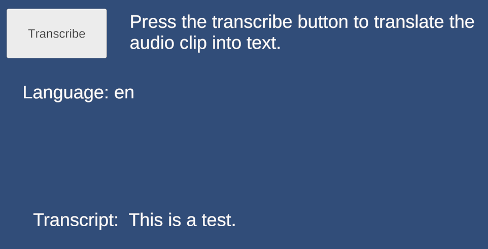
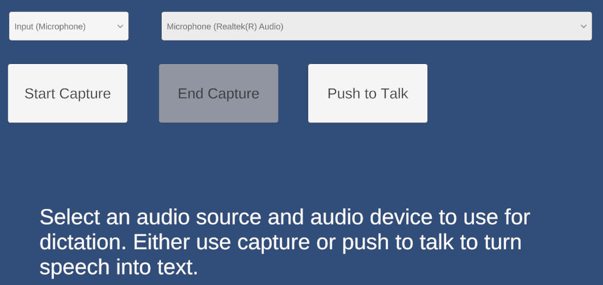

# Whisper Tiny EN (DirectML) Unity Package

Windows x64 package that embeds the OpenAI Whisper tiny English model inside a single native DLL, accelerated by ONNX Runtime with DirectML. Supports the Unity Editor and Windows Standalone 64-bit builds. Setup is turnkey and fully offline: no downloads, no updates—unpack the DLL, open the example scenes directly from the package, and choose your audio source (clip or microphone) for transcription or dictation.

## Platforms
- **Supported:** Windows 64-bit — Unity Editor and Windows Standalone player builds.
- **Not supported:** macOS, Linux, mobile, consoles.

## What’s inside
- Native plugin built on **ONNX Runtime + DirectML**; the full Whisper tiny EN model is contained in one DLL (no external model downloads, works fully offline).
- Editor utilities to unpack binaries and example content.
- Example scenes showing:
	- Audio clip transcription (from StreamingAssets).
	- Microphone capture for dictation with push-to-talk or continuous capture.

## Package contents
- **Plugins/Windows/x64**: native DirectML/ONNXRuntime DLL with the embedded Whisper tiny EN model (unpacked via menu).
- **Resources/Examples**: example scenes that can be opened directly from the package or copied into your project.
- **StreamingAssets/Audio**: sample `WhisperTest.wav` for clip-based transcription (unpacked via menu).
- **Editor scripts**: menu items to unpack DLLs, test audio, and examples.
- **C# samples**: microphone and clip transcription workflows.

## Quick setup
1) **Unpack the DLL:** `Assets → WhisperTinyEn → Unpack WhisperTinyEn DLLs` (combines the split archive into a single native DLL in `Plugins/Windows/x64`).
2) **Unpack test audio:** `Assets → WhisperTinyEn → Unpack WhisperTinyEn Example Audio` also drops the sample `WhisperTest.wav` into `Assets/StreamingAssets/Audio` for the clip-based example.
3) **Open an example scene (no import needed):** open directly from the package (or copy to your project if you prefer) and press Play in the Editor. Everything runs offline; no extra downloads are required.

## Audio sources
- **Audio Clip:** Use the included `WhisperTest.wav` in StreamingAssets, or point to your own clip. Clips are downmixed and resampled to 16 kHz mono before inference.
- **Microphone (dictation):** Uses Unity `Microphone` API (input). Modes:
	- **Continuous capture:** start/stop buttons, segments sent on silence break or max duration.
	- **Push-to-talk:** hold a button to capture, release to send.

## Example features
- Language detection + transcription from PCM (16 kHz mono floats).
- Rolling transcript buffer with max length guard.
- UI hooks via TextMeshPro; dropdowns to pick audio source/device (input only; loopback not implemented in this sample).

## Notes
- Prefers a DX12-capable GPU/driver for DirectML acceleration; will fall back to CPU if GPU isn’t available.
- Keep Plugins and StreamingAssets in place; the model DLL must remain alongside the plugin binaries.
- Works offline; no model downloads or updates required.
- Works in Editor and Windows Standalone 64-bit builds (x64 only).

## Tech stack
- **Model:** OpenAI Whisper (tiny.en) converted to ONNX.
- **Runtime:** ONNX Runtime with DirectML execution provider (Windows x64).
- **Unity:** TextMeshPro + UGUI for UI bindings; Unity `Microphone` API for input.

## Licensing
- This package is licensed under the **Unity Asset Store Terms of Service and EULA** (see <https://unity.com/legal/as-terms> and the license overview at <https://support.unity.com/hc/en-us/articles/208601846-Asset-Store-licenses-Extension-Assets-Single-and-Multi-Entity-assets>).
- This asset is intended to be treated as an **Extension Asset**; per Unity’s terms, you must purchase one seat per user who has access to the raw asset files.
- Third-party components:
	- **DirectML** (MIT, <https://github.com/microsoft/DirectML/blob/master/LICENSE>)
	- **ONNX Runtime** (MIT, <https://github.com/microsoft/onnxruntime/blob/main/LICENSE>)
	- **OpenAI Whisper** (MIT, <https://github.com/openai/whisper/blob/main/LICENSE>)

## Troubleshooting
- Missing TMPro types: ensure your asmdef references `Unity.TextMeshPro` (and `UnityEngine.UI` for UGUI).
- DLL load issues: confirm x64 Editor, DirectML-capable GPU/driver, and that DLLs were unpacked to `Plugins/Windows/x64`.
- No audio input devices: check OS privacy settings and that a microphone exists.

## Minimal API
```csharp
var whisperTinyEn = new DllWhisperTinyEn();          // create the client (loads the native DLL/model)

// pcm: float[] mono, 16 kHz samples
var language = whisperTinyEn.DetectLanguage(pcm);    // detect language
var transcript = whisperTinyEn.Decode(pcm);          // decode transcript
```

That’s it: create the client, pass PCM (mono, 16 kHz floats), detect language, and decode.

## Getting PCM data

### From an AudioClip
```csharp
var clip = /* your AudioClip */;                              // source clip
var buffer = new float[clip.samples * clip.channels];         // allocate interleaved buffer
clip.GetData(buffer, 0);                                      // read samples from clip

// Downmix to mono and resample to 16 kHz if needed
float[] pcmMono16k = DownmixAndResample(buffer, clip.channels, clip.frequency, targetRate: 16000);
```

### From Microphone (Unity `Microphone` API)
```csharp
string device = Microphone.devices.FirstOrDefault();          // pick a mic
int sampleRate = 16000;                                       // request 16 kHz
var micClip = Microphone.Start(device, loop: true, lengthSec: 20, frequency: sampleRate);

// Periodically read new samples, append to a List<float>, then send segments to Whisper
micClip.GetData(tempBuffer, offsetSamples);                   // grab the newest chunk
float[] pcmMono16k = tempBuffer;                              // already mono 16 kHz when requested
```

Guidelines:
- Aim for mono 16 kHz floats. Downmix if the clip is stereo, and resample if its rate differs from 16 kHz.
- For mic input, request 16000 Hz in `Microphone.Start` to avoid resampling; otherwise resample to 16 kHz before calling the API.

## Examples

* WhisperExampleAudioClip: Translate an audio clip to text.



* WhisperExampleMicrophone: Translate an audio source to text.


